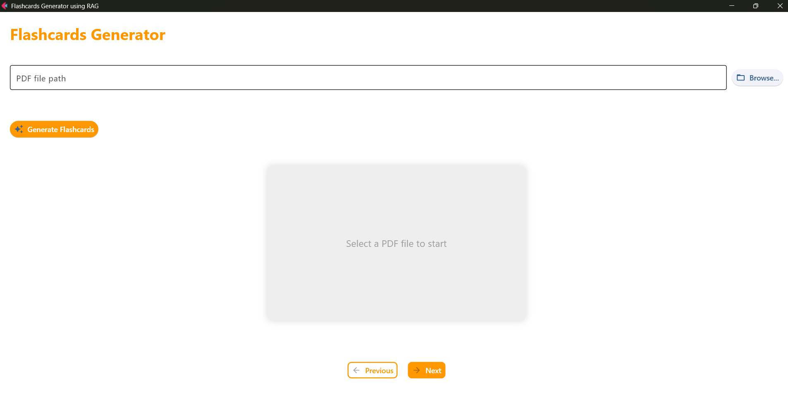

# Flash-Card-Gen-Using-RAG

Flash-Card-Gen-Using-RAG is a project that leverages HuggingFace endpoints and Retrieval-Augmented Generation (RAG) to automatically generate flashcards from user-provided PDF documents. By extracting key information and generating question-answer pairs, it aids in efficient learning and quick revision.



The above UI is made using FLET in python. The prompt for the model is defined in such way that model only outputs the question and answers in the form of dictionary,questions are keys and values are answers. One can touch the flash card to flip it to know the answer.

### Installation guide

```s
pip install requirements.txt
```

make .env and add your gemini api key in it

```s
GOOGLE_API_KEY = "<your_api_key>"
```

### Demo Video

Flash cards generated for pdf containing information about AI-agents

https://github.com/user-attachments/assets/a617245e-c72e-4326-9535-28b7ec81fdc3

Feel free to try and suggestions are always welcome!!
