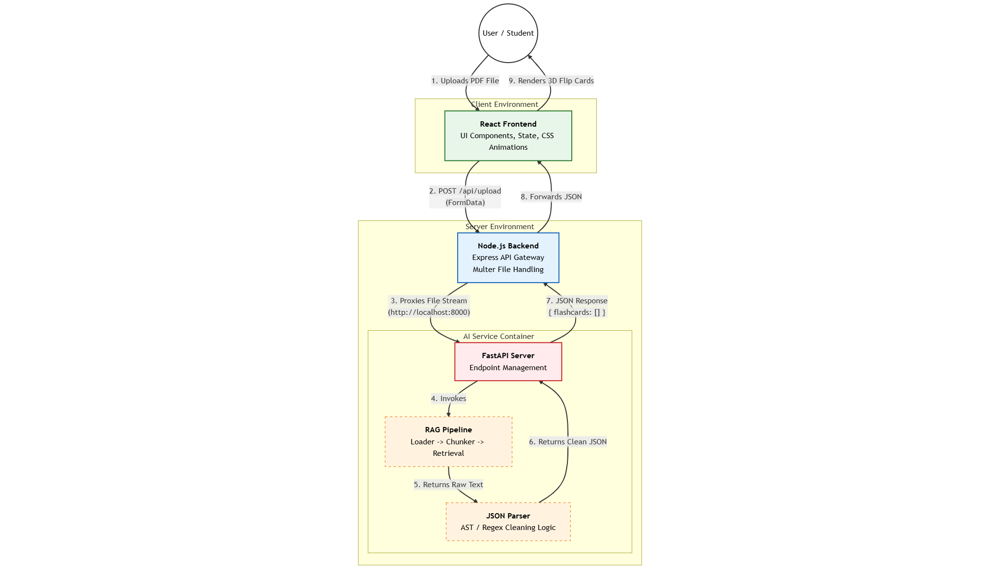

# Flash-Card-Gen-Using-RAG

Flash-Card-Gen-Using-RAG is a project that leverages Gemini endpoints and Retrieval-Augmented Generation (RAG) to automatically generate flashcards from user-provided PDF documents. By extracting key information and generating question-answer pairs, it aids in efficient learning and quick revision.

This project uses a 3-Tier Architecture featuring a React Frontend, Node.js Middleware, and a Python/FastAPI AI Service.

### System Architecture

The application is split into three distinct layers to ensure scalability and separation of concerns:



### Installation & Setup Guide

This project requires three terminal windows to run the separate services.

#### Step 1: Configure AI Service (Python)

1. Navigate to the AI service directory:
```bash
cd python-backend

```

2. Create a `.env` file inside `ai-service/` and add your API key:
```env
GOOGLE_API_KEY="<your_api_key>"

```

3. Install dependencies:
```bash
pip install -r requirements.txt
```

4. Run the service:
```bash
python -m uvicorn main:app --reload --port 8000

```

#### Step 2: Configure Backend (Node.js)

1. Open a new terminal and navigate to the backend:
```bash
cd backend

```

2. Install dependencies:
```bash
npm install express cors multer axios form-data

```

3. Run the server:
```bash
node server.js

```


#### Step 3: Configure Frontend (React)

1. Open a third terminal and navigate to the frontend:
```bash
cd frontend

```

2. Install dependencies:
```bash
npm install

```

3. Start the UI:
```bash
npm run dev

```

4. Open the link shown (usually `http://localhost:5173`) in your browser.

### Usage

1. **Upload:** Click "Browse PDF" to select your study material.
2. **Generate:** Click the "Generate Flashcards" button.
3. **Study:**
* Click a card to flip it and reveal the answer.
* Use the Arrow Keys or on-screen buttons to navigate between cards.


### Demo Video


Feel free to try it out! Suggestions and contributions are always welcome.